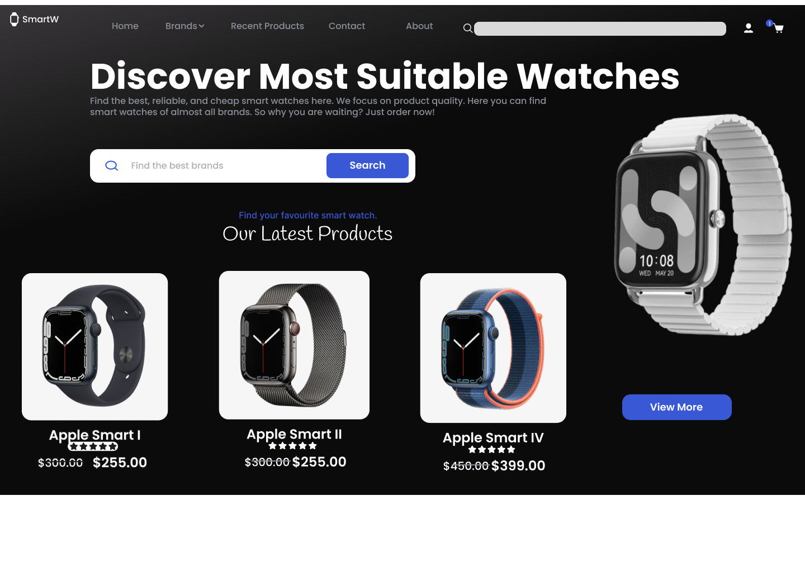

# Smartwatch E-commerce Website Design

This repository showcases a UI/UX design concept for a clean and modern e-commerce website landing page focused on selling smartwatches. The design was created in Figma.

## 🖼️ Design Preview

---

## 🚀 Interactive Prototype

You can view and interact with the live Figma prototype to explore the design in more detail.

  <a href="https://www.figma.com/proto/c8emZdCo2r14Zt5dJDG5NX/E-commerce-website?node-id=202-3&p=f&t=7vwWESTmuCfYix6h-1&scaling=scale-down&content-scaling=fixed&page-id=0%3A1">
    <strong>➡️ Open Interactive Figma Prototype</strong>
  </a>

---

## ✨ Key Features

* **Hero Section:** A prominent "Discover" section to immediately capture user attention.
* **Search Functionality:** A clean search bar for finding specific brands or products.
* **Product Showcase:** A grid layout for displaying the latest products with clear pricing and ratings.
* **Featured Product:** A large, detailed view of a highlighted product with a "View More" call-to-action.
* **Minimalist Navigation:** A simple and intuitive header with key navigation links.
